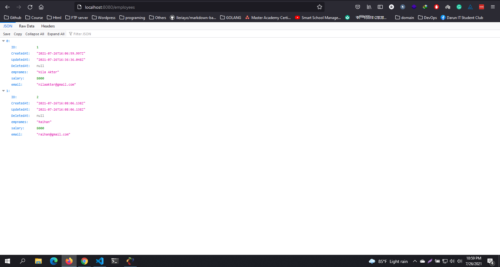
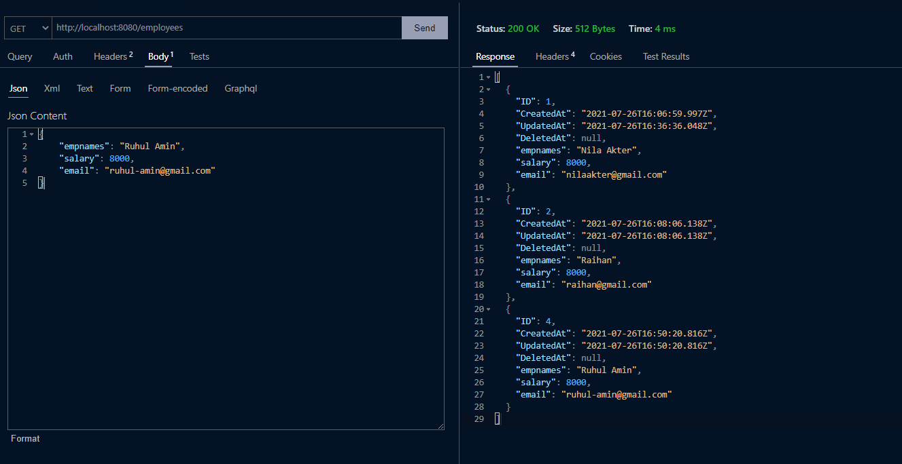
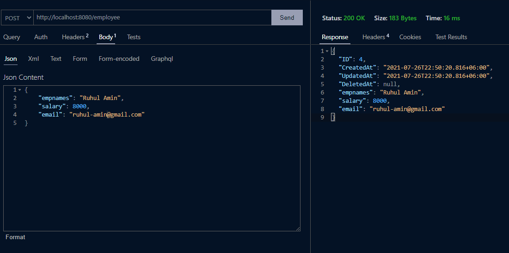
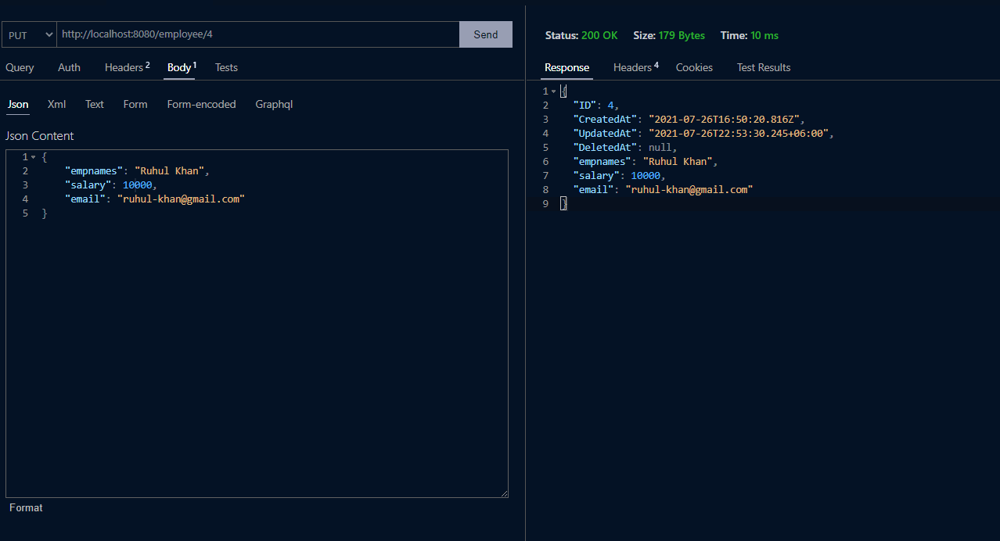
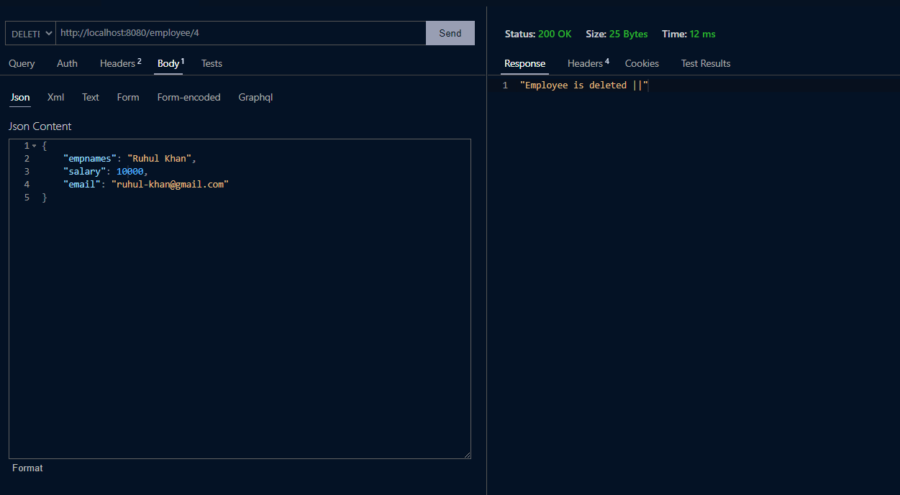

#  Golang RestAPI using gorilla/mux
##  Golang restAPI crud project with mySql database.
[![Facebook-Page][facebook-shield]][facebook-url] [![Instagram][instagram-shield]][instagram-url] [![LinkedIn][linkedin-shield]][linkedin-url]

<!-- MARKDOWN LINKS & IMAGES -->

<!-- -->
[facebook-shield]:  https://img.shields.io/badge/-Facebook-black.svg?style=flat-square&logo=facebook&color=555&logoColor=white

[facebook-url]:  https://facebook.com/raihan.mahmudi.50

[instagram-shield]:  https://img.shields.io/badge/-Instagram-black.svg?style=flat-square&logo=instagram&color=555&logoColor=white

[instagram-url]:  https://www.instagram.com/raihan_info/

[linkedin-shield]:  https://img.shields.io/badge/-LinkedIn-black.svg?style=flat-square&logo=linkedin&colorB=555

[linkedin-url]:  https://www.linkedin.com/in/raihaninfo/

##  Test Api with [Thunder Client](https://marketplace.visualstudio.com/items?itemName=rangav.vscode-thunder-client) vs code beautiful Extension. and use Best vs-code dark color [Theme](https://marketplace.visualstudio.com/items?itemName=raihaninfo.rm-dark-theme)  **Rm Dark Theme**

##  GET All data

    http://localhost:8080/employees

  

##  GET data by id

    http://localhost:8080/employee/2

##  POST new data

##  UPDATE data

##  DELETE data

## Happy Coding 🇧🇩

